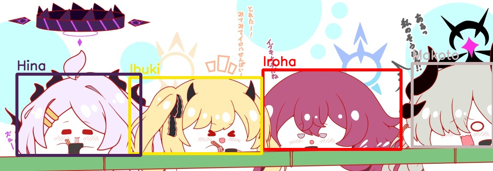

# TUGAS 1
Buatlah empat bounding box megelilingi empat karakter yang ada pada gambar tugas1.jpg (nama ngga perlu, asalkan warna bounding box sudah sesuai karakter)

Karakter dari kiri-kanan:
- Hina: (90, 35, 75)
- Ibuki: (0, 230, 250)
- Iroha: (0, 0, 255)
- Makoto: (180, 180, 200)

### PENILIAAN
- Jumlah bounding box
- Akurasi threshold warna bounding box
- Kerapihan code
