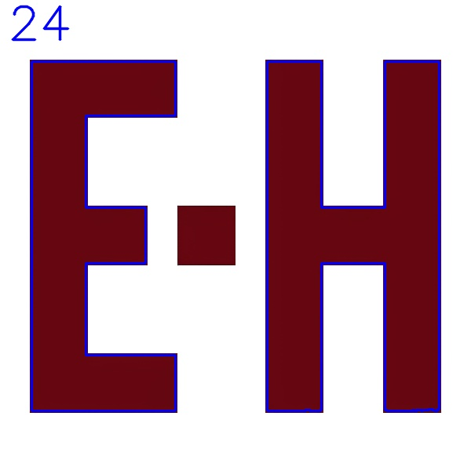

# TUGAS 2
Hitunglah banyak sisi pada huruf E dan H pada gambar tugas2.png (jangan tulis "24" doang su, anak tk juga bisa)

### PENLILAIAN
- Ketepatan jumlah sisi
- Kerapian code

overwrite ae templatenya (tugas2.py)